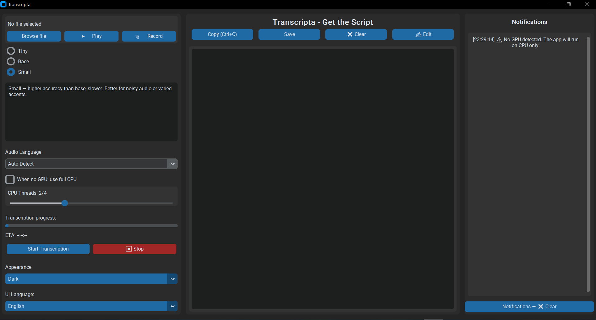

# Transcripta Lite

**Transcripta Lite** is a modern desktop application that converts speech and audio files into accurate text using OpenAI’s Whisper model.  
It provides an intuitive, clean interface built with **CustomTkinter**, offering users full control over model selection, CPU/GPU usage, and output formatting.

<p align="center">
  
</p>

The app allows you to:
- Transcribe audio or video files directly to text.(multilingual)(+90 language)
- Record speech in real-time and save it in multiple formats (WAV, MP3, FLAC).
- Copy, edit, and save the transcribed text in `.txt` or `.docx` formats.
- Choose between **light** and **dark** themes.
- Instantly switch the entire UI language — supports English, Arabic, and up to 10 languages.
- Select from multiple Whisper models (*Tiny*, *Base*, *Small*) to balance between speed and accuracy.
- Control how many **CPU threads** are used for transcription to boost performance when running without a GPU.

Transcripta Lite is designed for creators, journalists, students, and professionals who need fast and reliable speech-to-text transcription on their desktop — without any complicated setup.
Transcripta Lite is a free and open-source desktop application that runs **100% offline**, ensuring complete privacy and security for your recordings.  

---

##  Installation & Setup

### 1. Prerequisites
Before running Transcripta Lite , make sure you have:
- **Python 3.10 or higher** installed.
- **FFmpeg** available in your system PATH (required for audio conversion).
- A stable offline environment (the app runs 100% locally).
### FFmpeg Setup (Required)
Transcripta Lite requires **FFmpeg** for audio conversion and playback.  
If FFmpeg is not installed, please follow our detailed step-by-step guide here:

[How to install FFmpeg on Windows, macOS, and Linux](docs/FFmpeg_Setup.md) 

- (Optional) **NVIDIA GPU** for faster transcription (CUDA supported)
- Check with: `nvidia-smi` or `python -m torch.cuda.is_available`

### 2. Install Required Packages
Depending on your device, you can choose one of the two requirement files:

**For CPU users:**
```bash
pip install -r requirements_cpu.txt
```
**For GPU users (with NVIDIA GPU + CUDA installed):**
```bash
pip install -r requirements_gpu.txt
```

**Before installation, you can check whether your computer has an NVIDIA GPU (for CUDA support):**

[Follow this guide to check your GPU availability](docs/Check_GPU.md)
or simply run:
```bash
python Get_gpu_Cpu_Names.py
```

## Install Microsoft Visual C++ Redistributable (Required for Windows)

Some dependencies used by Transcripta Lite — such as PyQt5, PyTorch, and certain audio modules — require the Microsoft Visual C++ Redistributable to run properly on Windows.

Download & install the latest supported version from Microsoft:

Download (Official Microsoft Page):

https://aka.ms/vs/17/release/vc_redist.x64.exe

After installing, restart your computer.

[Check our installation guide step by step](docs/VC_Redist_Required.md)

## 3. After installing all dependencies, simply run:

```text
run_transcripta.bat
```

The launcher will automatically start **Transcripta Lite**.
- The Transcripta Lite window will open automatically.

## 4. If you encounter missing package errors, install them manually using:
- pip install package_name

**Example** 
- pip install customtkinter

---
## How to Use Transcripta Lite

Once Transcripta Lite is installed and running, follow these simple steps to start transcribing your audio or video files:

### 1. Choose an Audio or Video File
- Click **Browse** in the left panel to select a file (`.wav`, `.mp3`, `.mp4`, `.m4a`, `.ogg`, `.opus`, `.flac`, etc.).
- The selected file path will appear in the interface, and a short notification will confirm it.

### 2. (Optional) Record Your Voice
- Click **Record** to capture live speech directly from your microphone.
- When finished, click **Stop Record** and choose your desired audio format (WAV, MP3, or FLAC).
- The recording will automatically be available for transcription.

### 3. Select the Model
- Choose between:
  - **Tiny** – fastest, less accurate
  - **Base** – balanced performance
  - **Small** – slower but highest accuracy  
- This lets you control the trade-off between **speed** and **accuracy** depending on your needs.

### 4. Optimize CPU/GPU Usage
- If your computer has a **GPU**, the app will automatically detect and use it for faster transcription.
- If no GPU is detected:
  - You can enable **Use full CPU** to utilize all processor threads.
  - Or manually adjust the **thread slider** to balance speed and system load.

### 5. Start the Transcription
- Click **Start** to begin transcribing.
- The progress bar and ETA (Estimated Time Remaining) will update as Whisper processes your file.
- When finished, the transcribed text appears instantly in the editor area.

### 6. Review & Edit
- You can **copy**, **edit**, or **clear** text directly inside the built-in editor.
- For advanced editing, click **Edit** to open the text in a PyQt-based rich editor window.

### 7. Save Your Transcription
- Click **Save** to export your text as:
  - `.txt` (plain text)
  - `.docx` (Word document)  
- All files are saved locally — no internet connection is ever required.

### 8. Additional Options
- Change the interface **theme** (Light or Dark).
- Instantly switch the **UI language** from the dropdown menu.
- View all messages, logs, and alerts in the **Notifications panel** on the right.

---

**Tip:**  
If you close the app while a transcription is running, it will stop automatically to prevent corrupted files.  
All settings (language, theme, and model selection) are remembered between sessions.

---

## Features Overview

Transcripta Lite combines performance, simplicity, and flexibility — all in lightweight desktop package.  
Here’s an overview of its key features:

### Audio & Video Transcription
- Supports all major formats: **WAV, MP3, MP4, M4A, FLAC, OGG, OPUS**, and more.  
- Converts speech to text using **OpenAI’s Whisper** model for top-tier accuracy.  
- Works fully **offline**, keeping your audio and text private on your device.

### Real-Time Recording
- Record directly from your microphone without external tools.  
- Save recordings automatically in **WAV**, **MP3**, or **FLAC** format.  
- Option to convert files after recording for compact storage.

### Model Selection & Performance Control
- Choose between multiple Whisper models:
  - **Tiny** (Fastest)
  - **Base** (Balanced)
  - **Small** (Most Accurate)  
- Adjust **CPU thread usage** to boost performance on non-GPU systems.  
- Automatic **GPU detection** for NVIDIA CUDA and Apple Metal acceleration.

### Smart Text Editor
- Built-in **CustomTkinter editor** with undo/redo and keyboard shortcuts.  
- Integrated **PyQt5 text window** for larger or formatted editing.  
- Supports copy, clear, and quick export functions.

### Multi-Language Interface
- Instantly switch the app UI between multiple languages (English, Arabic, and up to 10 others).  
- All translations are handled dynamically without restarting the app.

### Modern User Interface
- Elegant and minimal design built with **CustomTkinter**.  
- Supports **Light** and **Dark** modes.  
- Resizable, responsive layout across all desktop systems.

### Flexible Export Options
- Save transcripts as plain text (`.txt`) or Word document (`.docx`).  
- Automatic creation of recording folders.  
- Clear and timestamped **notifications panel** to track all app activity.

### Privacy 
- 100% offline — **no internet required** for transcription or recording.  
- Your audio and text files never leave your device.
- Free and open-source under the Apache License.

---

## Troubleshooting

If you encounter an issue, check the quick references below:

| Issue | Possible Cause | Solution |
|-------|----------------|-----------|
| **App says “FFmpeg not found”** | FFmpeg not installed or not added to PATH | [Follow FFmpeg setup guide](docs/FFmpeg_Setup.md) |
| **“No GPU detected” message** | Running on CPU only | [Check GPU availability](docs/Check_GPU.md) |
| **“Whisper not installed”** | Missing dependencies | Run `pip install -r requirements_cpu.txt` or `requirements_gpu.txt` |
| **Audio won’t play** | Missing player or unsupported format | Ensure FFmpeg or VLC is installed |
| **Save as DOCX failed** | `python-docx` not installed | Run `pip install python-docx` |

**Tip:** All errors are also logged in the app’s notification panel with timestamps.
